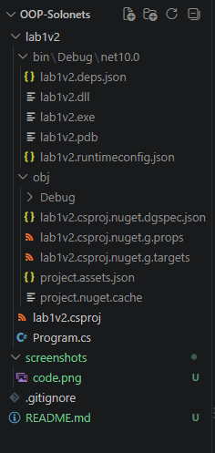
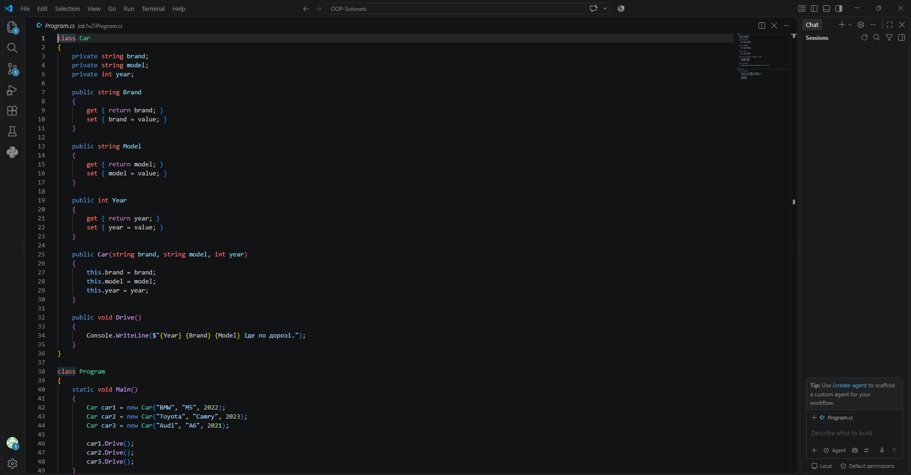
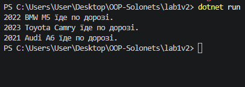

# Лабораторна робота №1

## Тема

Створення класу в C# із використанням приватних полів,
публічних властивостей, конструктора та методів.

## Мета

Ознайомитися з основами об'єктно-орієнтованого програмування
в C#, навчитися створювати класи та об'єкти, використовувати
інкапсуляцію, конструктори, властивості й методи, а також
працювати з Git та GitHub.

## Хід роботи

### 1. Створення проєкту

Було створено C#-проєкт `lab1v2` у директорії
`OOP-Solonets`.

### 2. Реалізація класу Car

Було створено клас `Car`, який містить:
- приватні поля `brand`, `model`, `year`;
- публічні властивості `Brand`, `Model`, `Year`;
- конструктор;
- метод `Drive()`.

### 3. Створення об'єктів

У програмі було створено три об'єкти класу `Car`:

- BMW M5, 2022;
- Toyota Camry, 2023;
- Audi A6, 2021.

Для кожного об'єкта було викликано метод `Drive()`.

### 4. Результат виконання

Програма успішно компілюється та запускається.

Результат:

2022 BMW M5 їде по дорозі.  
2023 Toyota Camry їде по дорозі.  
2021 Audi A6 їде по дорозі.

### 5. Git та GitHub

Було створено Git-репозиторій, додано `.gitignore`,
виконано коміти та завантажено проєкт до GitHub.

## Скріншоти

### Структура проєкту

### Код програми

### Результат виконання
