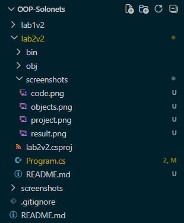
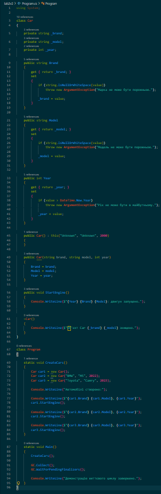
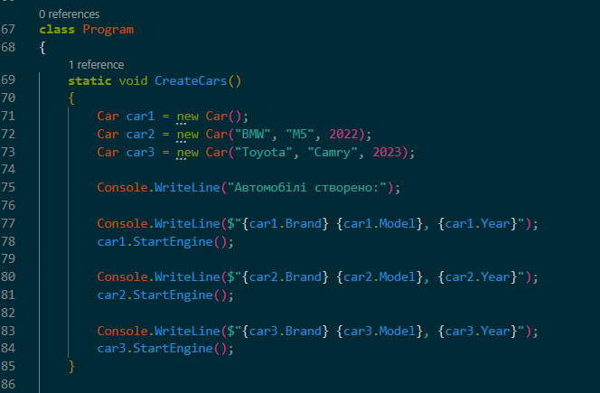
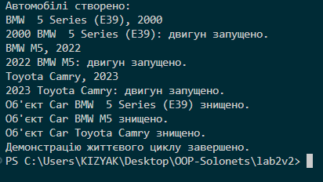

# Лабораторна робота №2

## Об'єктно-орієнтоване програмування

**Тема:** Клас із кількома конструкторами. Життєвий цикл об'єкта.

**Виконав:** Солонець Артем
**Варіант:** 2
**Мова програмування:** C# / .NET
**Середовище розробки:** Visual Studio Code
**Проєкт:** `OOP-Solonets/lab2v2`

---

## 1. Мета роботи

Навчитися створювати класи в C#, використовувати перевантажені конструктори та ланцюговий виклик конструкторів за допомогою `: this()`. Дослідити життєвий цикл об'єкта, роботу фіналізатора та збирача сміття `Garbage Collector`.

---

## 2. Постановка завдання

За індивідуальним варіантом необхідно реалізувати клас **Car**.

Клас повинен містити:

* приватні поля `_brand`, `_model`, `_year`;
* публічні властивості `Brand`, `Model`, `Year`;
* валідацію року випуску — рік не може бути більшим за поточний;
* мінімум два перевантажені конструктори;
* ланцюговий виклик одного конструктора з іншого через `: this()`;
* метод `StartEngine()`;
* фіналізатор, який виводить повідомлення про знищення об'єкта.

У методі `Main()` необхідно створити декілька об'єктів різними конструкторами, викликати їхні методи та продемонструвати роботу збирача сміття.

---

## 3. Структура проєкту

```text
OOP-Solonets/
├── .gitignore
├── README.md
└── lab2v2/
    ├── Program.cs
    └── lab2v2.csproj
```

---

## 4. Реалізація класу Car

У програмі реалізовано клас `Car` з приватними полями:

```csharp
private string _brand;
private string _model;
private int _year;
```

Для доступу до даних використовуються публічні властивості `Brand`, `Model` та `Year`.

Властивість `Year` містить перевірку, яка не дозволяє встановити рік, більший за поточний.

Клас має два конструктори:

1. Конструктор без параметрів із початковими значеннями.
2. Параметризований конструктор.

Конструктор без параметрів використовує ланцюговий виклик:

```csharp
: this("Unknown", "Unknown", DateTime.Now.Year)
```

Також у класі реалізовано метод `StartEngine()`, який демонструє запуск двигуна автомобіля.

Фіналізатор використовується для демонстрації завершення життєвого циклу об'єкта.

---

## 5. Створення та використання об'єктів

У методі `Main()` створено декілька об'єктів класу `Car` з використанням різних конструкторів.

Приклад створення об'єктів:

```csharp
Car car1 = new Car();

Car car2 = new Car("Toyota", "Camry", 2020);

Car car3 = new Car("BMW", "X5", 2023);
```

Для кожного об'єкта викликається метод:

```csharp
car1.StartEngine();
car2.StartEngine();
car3.StartEngine();
```

У результаті програма виводить інформацію про запуск двигунів автомобілів.

---

## 6. Робота збирача сміття

Наприкінці роботи програми виконується:

```csharp
GC.Collect();
GC.WaitForPendingFinalizers();
```

`GC.Collect()` примусово запускає збирач сміття, а `GC.WaitForPendingFinalizers()` очікує завершення роботи фіналізаторів.

Це використано лише для навчальної демонстрації життєвого циклу об'єктів.

---

## 7. Результат виконання

Після запуску програми в консолі відображаються повідомлення про створення та використання об'єктів класу `Car`, а також результати виклику методу `StartEngine()`.

---

## 8. Демонстрація конструкторів

У роботі продемонстровано використання:

* конструктора без параметрів;
* параметризованого конструктора;
* ланцюгового виклику конструкторів через `: this()`.

Це дозволяє створювати об'єкти класу різними способами та уникати дублювання коду ініціалізації.

---

## 9. Демонстрація валідації

Властивість `Year` перевіряє коректність року випуску автомобіля.

Якщо передати рік, який перевищує поточний, програма не дозволяє встановити некоректне значення.

---

## 10. Демонстрація роботи Garbage Collector

Після завершення основної роботи програми викликаються:

```csharp
GC.Collect();
GC.WaitForPendingFinalizers();
```

Це дозволяє побачити повідомлення від фіналізаторів та продемонструвати завершення життєвого циклу об'єктів.

---

## 11. Контрольні запитання

### 1. Що таке перевантаження конструкторів і яку перевагу воно дає?

Перевантаження конструкторів — це створення декількох конструкторів одного класу з різними наборами параметрів. Це дозволяє створювати об'єкти різними способами залежно від необхідних початкових даних.

### 2. Як за допомогою `: this()` можна уникнути дублювання коду ініціалізації?

`this()` дозволяє одному конструктору викликати інший конструктор цього самого класу. Завдяки цьому спільний код ініціалізації знаходиться в одному місці і не дублюється.

Наприклад:

```csharp
public Car() : this("Unknown", "Unknown", DateTime.Now.Year)
{
}
```

### 3. Хто і в який момент викликає деструктор (фіналізатор) у C#?

Фіналізатор викликається автоматично збирачем сміття перед остаточним видаленням об'єкта з пам'яті. Точний момент його виконання наперед визначити не можна.

### 4. Чому в реальних програмах не рекомендується викликати `GC.Collect()` вручну?

Примусовий запуск збирача сміття може негативно вплинути на продуктивність програми. У звичайних програмах керування пам'яттю виконується автоматично середовищем .NET.

---

## 12. Git та GitHub

Для збереження проєкту використовується система контролю версій Git.

Основні команди:

```bash
cd OOP-Solonets
git add .
git commit -m "Lab2: реалізовано клас Car"
git push
```

Проєкт розміщено в репозиторії GitHub.

**Посилання на репозиторій:**

https://github.com/solonetsavipz24-prog/OOP-Solonets

---

## 13. Висновок

Під час виконання лабораторної роботи було реалізовано клас `Car` мовою C#. Було використано приватні поля, публічні властивості з валідацією, перевантажені конструктори та ланцюговий виклик конструкторів за допомогою `: this()`.

Також було реалізовано метод `StartEngine()` та фіналізатор для демонстрації життєвого циклу об'єкта. У методі `Main()` створено декілька об'єктів класу різними конструкторами та продемонстровано їхню роботу.

Окремо було досліджено роботу збирача сміття за допомогою `GC.Collect()` та `GC.WaitForPendingFinalizers()`.

У результаті було закріплено практичні навички роботи з класами, конструкторами, властивостями, методами та життєвим циклом об'єктів у C#.

---

## Скріншоти виконання

### 1. Структура проєкту



---

### 2. Код класу Car



---

### 3. Створення об'єктів



---

### 4. Результат виконання програми


